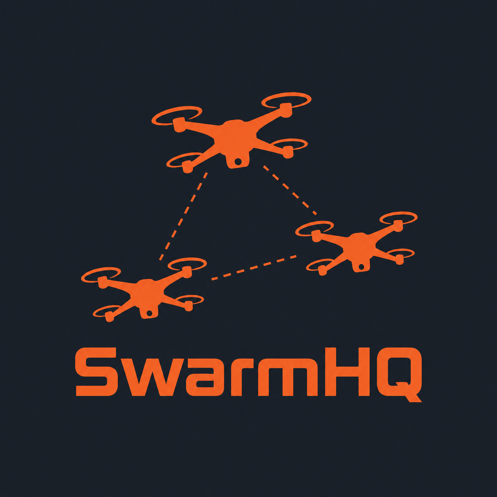

# SwarmHQ

<p align="center">
  
</p>

<p align="center">
  <a href="https://github.com/Mango77x/SwarmHQ/actions/workflows/ci.yml">
    
  </a>
  <a href="HELP.md">
    
  </a>
  <a href="PROJECT_OVERVIEW.md">
    
  </a>
</p>

SwarmHQ is a simulated drone command-and-control (C2) platform: a fleet of
quadcopters reporting telemetry over MQTT, a Spring Boot backend turning
that stream into geospatial data and live alerts, and a React map where the
whole fleet moves in real time.

**No real hardware, no real data, no targeting or weapons capability.**
Every drone, mission, and telemetry reading is synthetic. The point isn't
the drones themselves, it's the engineering underneath them: IoT
messaging, geospatial queries, real-time web, and multi-agent coordination,
the same building blocks used in logistics, fleet management, and any
system that has to track many independent moving things at once.

---

## Highlights

- **MQTT telemetry**: each drone is its own authenticated client publishing
  position, battery, and status. Same protocol real drone hardware speaks,
  not a REST poll standing in for it
- **PostGIS geometry**: positions are stored as actual points, so "which
  drones are inside this zone" is a spatial query, not a loop of manual
  distance math
- **Live tactical map**: MapLibre GL JS, drones animating over a WebSocket
  feed, alerts firing the moment a drone drops below a battery threshold,
  drifts into a restricted zone, or goes dark
- **Mission assignment, two ways**: a centralized engine that matches the
  closest eligible drone to a mission, and a decentralized alternative
  where drones bid on missions themselves. Both are switchable at runtime,
  so the two strategies can be compared side by side
- **Swarm movement**: patrol routes can run on boids flocking (separation,
  alignment, cohesion) instead of a fixed loop, drones forming and
  reforming as a flock the way the project's name implies
- **Resilience by design**: signal loss, GPS noise, and Kalman-filtered
  position smoothing are all part of the simulation, not edge cases bolted
  on afterward

<details>
<summary>Resumen en español 🇪🇸</summary>

SwarmHQ es una plataforma de mando y control (C2) para una flota de drones
completamente simulada: sin hardware real, sin datos reales, sin ninguna
capacidad de targeting o armamento. El objetivo es la ingeniería detrás del
sistema (mensajería IoT sobre MQTT, datos geoespaciales con PostGIS, mapa
en tiempo real vía WebSocket y coordinación entre múltiples agentes o
swarming), aplicable igual de bien a logística o gestión de flotas que a
un contexto de defensa.

Detalles técnicos completos en [PROJECT_OVERVIEW.md](PROJECT_OVERVIEW.md).

</details>

---

## Tech stack

- Java 21, Spring Boot (Web, Data JPA, WebSocket/STOMP)
- PostgreSQL + PostGIS, Hibernate Spatial
- Eclipse Mosquitto, MQTT over TLS with per-drone credentials
- Python drone simulator (paho-mqtt, numpy)
- React 19, TypeScript, Vite, Tailwind, MapLibre GL JS
- Docker Compose for the full stack, GitHub Actions for CI

Rationale behind each choice lives in [PROJECT_OVERVIEW.md](PROJECT_OVERVIEW.md).

---

## Docs

- [PROJECT_OVERVIEW.md](PROJECT_OVERVIEW.md): architecture, data model, and
  every subsystem explained in depth
- [HELP.md](HELP.md): how to run it locally, environment variables, and a
  running log of the trickier bugs this project has surfaced

---

## Run it

```bash
cp .env.example .env
docker compose up -d
```

That starts the infrastructure (Mosquitto, PostgreSQL/PostGIS). To run the
full application in a container as well:

```bash
docker compose up -d --build backend
```

Then open `http://localhost:8080/app`. [HELP.md](HELP.md) covers ports,
environment variables, running the simulator, and troubleshooting.

---

## Scope and ethical boundaries

This is a software engineering exercise in backend architecture, geospatial
data, and real-time systems. It does not implement, and will not implement,
anything related to real targeting, weapons, or a capability that could be
repurposed to cause harm.

---

## License

Educational and portfolio use.

---

## Contributing

PRs are welcome.

- Keep changes small and focused
- Business logic belongs in the service layer, not the controllers
- Add or adjust tests when behavior changes

---

## Author

Built and maintained by [Mango77x](https://github.com/Mango77x).
